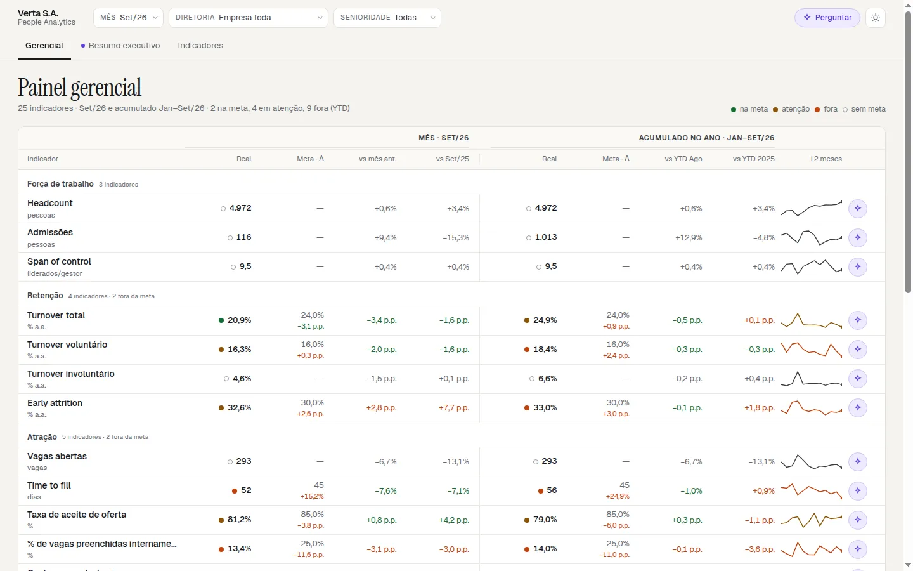
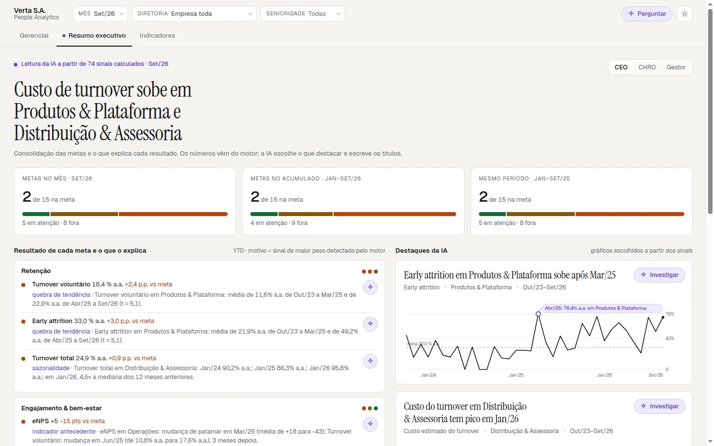
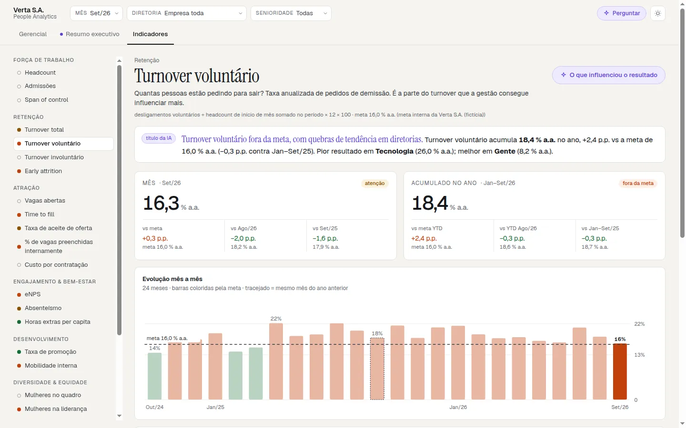
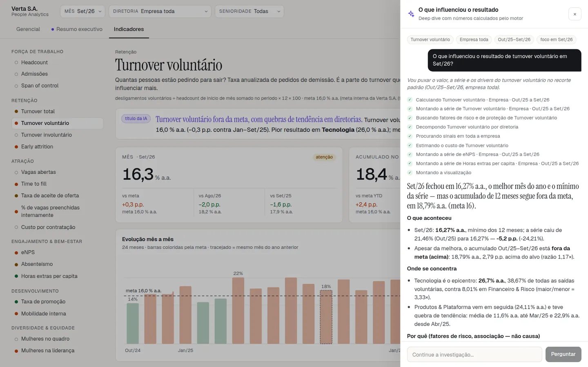

# Dashboard Conversacional · People Analytics com IA

Um ensaio do data viz na era da IA: o painel mostra o que importa, a IA escolhe o destaque e investiga o porquê, e o código calcula cada número.

**Demo ao vivo:** https://dash-conversacional.luccabuilds.com

https://github.com/user-attachments/assets/8f83d6a7-564c-4822-8c27-a32cd0f215bf

## O que tem aqui

São três áreas, todas com os filtros na URL (mês, diretoria, senioridade):

- **Gerencial** (`/`): os 25 indicadores do painel, mês e acumulado do ano contra a meta, variação contra o mês anterior e contra o ano anterior, e a tendência de 12 meses. Cada linha tem um ✦ que abre o deep dive daquele indicador.
- **Resumo executivo** (`/resumo`): a leitura da IA sobre os sinais que o motor detectou. Traz manchete, metas consolidadas, o resultado de cada meta com o motivo e os gráficos de destaque, em três lentes (CEO, CHRO, gestor).
- **Indicador** (`/indicadores/[id]`): a ficha de cada indicador (pergunta, fórmula, meta), mês e acumulado, evolução de 24 meses, quebra por diretoria ou senioridade, os sinais detectados e um título escrito pela IA.

O **deep dive com IA** abre numa gaveta à direita (no celular, numa folha de baixo para cima). O agente consulta o motor com ferramentas, narra cada consulta enquanto ela roda, escreve a análise em streaming e monta os gráficos a partir dos resultados. A barra de cima também aceita pergunta livre. Na versão publicada, o deep dive roda em [modo demonstração](#modo-demo-e-ia-ao-vivo), com respostas gravadas.

| Gerencial | Resumo executivo | Indicador | Deep dive |
|---|---|---|---|
|  |  |  |  |

## A IA decide a apresentação, o código decide os números

Essa é a regra do projeto inteiro.

- Todo número sai do motor determinístico (`lib/analytics/engine.ts`) sobre o catálogo de indicadores. O modelo nunca calcula: ele chama ferramentas (`valor`, `serie`, `decompor`, `cruzar`, `comparar`, `drivers`, `impacto`, `sinais`) e recebe resultados prontos, com o status contra a meta já calculado.
- Os gráficos da resposta são montados pelo servidor a partir dos resultados das ferramentas. O modelo só escolhe qual resultado mostrar e em que formato.
- A **guarda de números** (`lib/agente/guarda.ts`) confere cada número do texto contra os resultados da conversa. O selo no fim da resposta diz quantos bateram, e o que não bateu aparece marcado no texto.
- **Como calculei** lista cada consulta ao motor com os argumentos, a fórmula, o período efetivo e o n.
- Na camada adaptativa (resumo executivo e títulos dos indicadores) a guarda é bloqueante: layout com número que não está nos sinais é descartado e a tela usa o layout determinístico; título descartado não entra, e a página fica só com a frase determinística.

## A Verta S.A. e as histórias dos dados

A Verta S.A. é uma corretora de investimentos fictícia com cerca de 5 mil pessoas em 6 diretorias. Os dados são sintéticos e cobrem 36 meses (Out/2023 a Set/2026; "hoje" é Set/2026). O gerador simula pessoa a pessoa, mês a mês, com seed fixa, e as histórias nascem de mecanismos (fuga de talento em Tecnologia, pico de janeiro em Distribuição & Assessoria, eNPS que antecipa o turnover em Operações, teto de vidro, onboarding fraco em Produtos & Plataforma e mais). Cada história, com o indicador que a mostra e o deep dive que revela a causa, está em [`docs/narrativa.md`](docs/narrativa.md).

## Stack

- Next.js 16 (App Router, Turbopack) com React 19 e TypeScript; telas como server components.
- CSS próprio sobre Tailwind CSS v4, fontes via `next/font`, gráficos em SVG próprio (sem biblioteca de gráficos).
- IA: DeepSeek (API compatível com OpenAI) como principal e OpenRouter como reserva, chamados com `fetch` e SSE escritos à mão.
- Dados: JSON gerado por script e versionado; sem banco.
- Testes com Vitest, sem rede (o modelo é simulado com um `fetch` falso).

Arquitetura completa em [`docs/architecture.md`](docs/architecture.md).

## Modo demo e IA ao vivo

O app tem dois modos, decididos só no servidor pela variável `IA_AO_VIVO`:

- **Demonstração (padrão, sem nenhuma variável):** nenhuma chamada de IA sai do servidor, mesmo com chaves no ambiente. `POST /api/agente` responde 403 `{"erro":"modo demonstração"}` sem montar provedor; `GET /api/layout` devolve o layout pré-gerado (`X-Layout-Fonte: pre-gerado`) ou, fora dele, o determinístico (`X-Layout-Fonte: demonstracao`). O painel da IA troca o campo de texto por perguntas prontas e toca respostas gravadas.
- **IA ao vivo (`IA_AO_VIVO=1` e uma chave):** o agente responde qualquer pergunta e o resumo executivo gera layouts fora dos recortes pré-gerados.

O modo chega ao navegador como prop do layout raiz, nunca por `NEXT_PUBLIC_*`.

**As respostas gravadas** são 72: as 2 perguntas de cada um dos 25 indicadores (a primeira é o "O que influenciou" que o ✦ abre), as 8 histórias de [`docs/narrativa.md`](docs/narrativa.md) e as 14 perguntas do resumo executivo, cada uma com 1 ou 2 continuações. `npm run gravar-demo` roda o agente de verdade (`executarAgente`, ferramentas e motor) com um provedor roteirizado no lugar do modelo, sem rede e sem chave: o roteiro (`lib/demo/roteiro*.ts`) diz que ferramentas chamar e o texto final, e a gravação falha se uma ferramenta der erro ou se a guarda não conferir 100% dos números do texto. Cada resposta vai para `public/demo/<id>.json` (baixada no clique, até 14 KB) e o índice leve para `lib/dados/cliente/demo.json`. `__tests__/demo/gravacoes.test.ts` regrava tudo e compara com os arquivos versionados.

**A animação** toca a gravação pelo mesmo `aplicarEvento` do stream ao vivo: de 1,5 a 3 s "pensando" ("Analisando…", a narração e os passos, cada passo concluindo em 300 a 900 ms), os gráficos entrando um a um em 150 a 250 ms e o texto em pedaços de 1 a 3 palavras. A escrita parte de 50 a 70 caracteres por segundo e acelera para a resposta inteira caber em 6 a 10 s, perto dos 7 s medidos ao vivo; como os textos têm de 421 a 931 caracteres (mediana 612), na prática sai a mais de 100 caracteres por segundo. "Mostrar tudo" ou um clique na resposta completa na hora; trocar de pergunta cancela a que está tocando; com `prefers-reduced-motion` a resposta aparece inteira. A gravação é de um recorte fixo: com a tela filtrada, a resposta mostra o recorte gravado e avisa que não é o do filtro.

## Como rodar

```bash
npm ci
npm run dev                  # http://localhost:3000, modo demonstração
```

Para a IA ao vivo:

```bash
cp .env.example .env.local   # IA_AO_VIVO=1 e DEEPSEEK_API_KEY
npm run dev
```

| Variável | Obrigatória | Para quê |
|---|---|---|
| `IA_AO_VIVO` | Não | `1` liga a IA ao vivo; qualquer outro valor, ou nenhum, é demonstração |
| `DEEPSEEK_API_KEY` | Sim, para a IA ao vivo | Provedor principal do agente, dos layouts e dos títulos |
| `DEEPSEEK_MODEL` | Não | Padrão `deepseek-flash` |
| `OPENROUTER_API_KEY` | Não | Reserva: usada só se a DeepSeek falhar (rede, 4xx/5xx, 429, timeout) |
| `OPENROUTER_MODEL` | Não | Padrão `deepseek/deepseek-v4.1-flash` |
| `NEXT_PUBLIC_APP_URL` | Não | URL pública, enviada ao OpenRouter como `HTTP-Referer` |

Com `IA_AO_VIVO=1` e sem chave, as telas usam os layouts e títulos pré-gerados (e o layout determinístico fora deles) e o deep dive responde 503. As chaves vivem só no servidor.

## Scripts

| Comando | O que faz |
|---|---|
| `npx tsx scripts/generate-data.ts` | Regera o dataset (roster, eventos e cubo). Mesma seed, mesmos bytes |
| `npm run gravar-demo` | Regrava as respostas do modo demonstração (`public/demo`) e o índice (`lib/dados/cliente/demo.json`), sem rede e sem chave. `--so=id1,id2` regrava só essas |
| `node --env-file=.env.local --import tsx scripts/generate-layouts.ts` | Pré-gera os 21 layouts do resumo executivo (empresa e 6 diretorias × 3 lentes). `--sem-ia` grava os determinísticos; `--limite=N` testa N sem gravar |
| `node --env-file=.env.local --import tsx scripts/generate-destaques.ts` | Pré-gera os títulos da IA por indicador (empresa e cada diretoria) |
| `node --env-file=.env.local --import tsx scripts/avaliar-agente.ts` | Avaliação real do agente com 20 perguntas: ferramentas chamadas, números conferidos, latência e custo. Gasta a chave, fica fora do CI |
| `npm run orcamento` | JS da primeira carga (gzip) por rota depois do `npm run build`; falha acima de 400 KB |
| `npm run demo-video` | Grava o vídeo de demonstração com Playwright e ffmpeg (`scripts/record-demo.mjs`) contra um `next start` em modo demonstração: `DEMO_BASE_URL` aponta o servidor e `DEMO_DRY=1` ensaia o roteiro sem gravar. Sai em `docs/demo/` (fora do git): `demo.mp4` (1080p, < 10 MB) e `demo-linkedin.mp4` (2560×1440) |
| `npm test` · `npm run lint` · `npx next typegen && npx tsc --noEmit` | Testes, lint e tipos (o `typegen` gera os tipos das rotas, que não são versionados) |

## Números medidos

JS da primeira carga por rota (gzip, `npm run orcamento` em 2026-10-06):

| Rota | JS |
|---|---|
| `/` e `/indicadores/[id]` | 207,5 KB |
| `/resumo` | 209,6 KB |
| `/indicadores` e `/_not-found` | 202,9 KB |

O índice das respostas gravadas (`lib/dados/cliente/demo.json`) tem 36,3 KB, 3,5 KB gzip; a maior resposta (`public/demo/turnover.json`) tem 13,8 KB, 3,3 KB gzip, e só é baixada no clique.

Agente na avaliação de 20 perguntas (`scripts/avaliar-agente.ts`, DeepSeek, 2026-10-05):

- Primeiro texto na tela: mediana 1,2 s, p90 2,6 s.
- Resposta completa: mediana 8,4 s, p90 11,2 s, máximo 11,4 s.
- Ferramenta esperada chamada em 20 de 20; guarda de números com 582 de 585 conferidos (99,4%).
- Custo da rodada inteira: menos de US$ 0,05.

Testes: 292 em 34 arquivos, cerca de 1,5 minuto com `--maxWorkers=1`, sem rede. O CI (`.github/workflows/ci.yml`) roda tipos, lint, testes, build e orçamento em todo push e pull request.

## Deploy (Vercel)

O `vercel.json` usa o preset do Next.js com `npm run build`. A versão publicada roda em modo demonstração e **não precisa de nenhuma variável de ambiente**. Recomendação: apague `DEEPSEEK_API_KEY` e `OPENROUTER_API_KEY` em Settings → Environment Variables. O modo demonstração já não as usa, mas sem elas um `IA_AO_VIVO=1` colocado por engano não tem como gastar crédito.

Para publicar com a IA ao vivo, crie `IA_AO_VIVO=1` e `DEEPSEEK_API_KEY` (as demais da tabela acima são opcionais). As duas rotas de API rodam em Node.js. `/api/agente` tem `maxDuration = 120` (um deep dive típico leva de 8 a 13 s; acima de 120 s a plataforma corta o stream) e `/api/layout` tem `maxDuration = 60`. Com o Fluid Compute, padrão da Vercel, todo plano aceita esses valores: o Hobby vai até 300 s ([limites de duração](https://vercel.com/docs/functions/configuring-functions/duration#duration-limits)).
