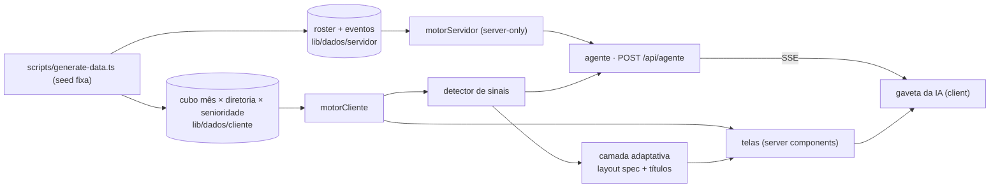

# Arquitetura

Regra que atravessa todas as camadas: **a IA decide a apresentação, o código decide os números.** O modelo escolhe o que destacar, em que ordem e com que palavras; todo número vem do motor determinístico e passa por uma guarda antes de chegar à tela.

## Dados

- **Gerador:** `scripts/generate-data.ts` chama `gerar()` (`scripts/sim/gerar.ts`), que simula a Verta S.A. pessoa a pessoa, mês a mês, de Out/2023 a Set/2026, com 6 meses de aquecimento antes da janela. A seed é fixa (`SEED` em `scripts/sim/calibracao.ts`) e o PRNG é próprio, então rodar de novo dá os mesmos bytes (`__tests__/analytics/determinismo.test.ts`). As histórias e os mecanismos estão em [`narrativa.md`](narrativa.md).
- **Roster no servidor:** `lib/dados/servidor/roster.json` (~6,6 MB) e `eventos.json` (~3 MB) têm cada pessoa com 16 dimensões (diretoria, especialidade, senioridade, gênero, raça, faixa salarial, performance, eNPS, trocas de gestor, onboarding…) e cada admissão, saída, promoção, movimentação e vaga. Só `lib/analytics/servidor.ts` os importa, e ele começa com `import 'server-only'`.
- **Cubo no cliente:** `lib/dados/cliente/cubo.json` (~177 KB, ~52 KB gzip) é o mesmo dado agregado por mês × diretoria × senioridade, com todas as medidas. É o único JSON que um módulo importável pelo navegador alcança; `__tests__/analytics/orcamento.test.ts` percorre o grafo de imports e falha se isso mudar ou se passar de 150 KB gzip.
- **Fatos aditivos:** `lib/analytics/fatos.ts` transforma o roster em três tabelas colunares (fluxo, estoque, vagas) em que toda medida é contagem ou soma. Qualquer recorte é a soma das linhas que passam nos filtros, e os segmentos reconciliam com o total por construção.

## Motor e catálogo

- **Catálogo** (`lib/analytics/catalog.ts`): 30 indicadores em 7 domínios, declarativos: pergunta, fórmula, unidade, polaridade, meta com origem e tolerância, dimensões válidas e cálculo (`total`, `razao` ou `compa`). O painel mostra 25 (`lib/painel/indicadores.ts`).
- **Motor** (`lib/analytics/engine.ts`): `criarMotor(fonte)` responde `valor`, `serie`, `decompor`, `cruzar`, `comparar`, `drivers` e `impacto` para qualquer indicador. Todo resultado traz um `rastreio` (função, fórmula, parâmetros, período efetivo, n, fonte). Recorte inválido vira `ErroConsulta` com as opções válidas.
- **Dois motores, o mesmo código:** `motorCliente` (`cliente.ts`) roda sobre o cubo e alimenta as telas e os sinais; `motorServidor()` (`servidor.ts`) roda sobre o roster, aceita todas as dimensões e é o único com `drivers` (lift por atributo e por par de atributos).
- **Status contra a meta:** `dentro` quando o valor está na meta ou melhor; `atencao` quando está pior, mas dentro da tolerância (padrão 10% da meta); `fora` além disso. Amostra abaixo de 30 vem marcada como insuficiente.
- **Esquemas** (`lib/analytics/schemas.ts`): um JSON Schema por função do motor, com um validador próprio. Os mesmos esquemas viram as tools do agente.

## Detector de sinais

`lib/analytics/signals.ts` percorre o catálogo num recorte e devolve sinais com evidência em texto e pontos de dado: `fora_da_meta`, `outlier_entre_diretorias`, `quebra_de_tendencia`, `piora_acelerada`, `sazonalidade` e `indicador_antecedente` (eNPS → turnover voluntário, vagas abertas → horas extras → absenteísmo). Cada sinal tem um score de 0 a 1, ponderado pela lente (CEO, CHRO, gestor). Os sinais alimentam o resumo executivo, a seção de sinais de cada indicador e a tool `sinais` do agente.

## Agente

- **Rota:** `POST /api/agente` (`app/api/agente/route.ts`, Node.js, `maxDuration = 120`). `lib/agente/http.ts` valida o corpo, corta o histórico em 12 mensagens, limita a 10 pedidos por minuto por IP e responde em SSE.
- **Loop** (`lib/agente/agente.ts`): até 6 rodadas de ferramentas; as chamadas da mesma rodada rodam juntas. Depois disso o modelo é obrigado a responder em texto. O system prompt (`prompt.ts`) traz o catálogo, as convenções de tempo, a regra dos números e, no deep dive, o recorte clicado e o roteiro (o que aconteceu, onde se concentra, por quê, quanto custa, o que fazer).
- **Ferramentas** (`ferramentas.ts`): uma por função do motor, mais `listarIndicadores`, `sinais` e `mostrar`. O modelo recebe um resumo arredondado do resultado, com campos prontos para não fazer contas (distância e razão contra a meta, status em palavras, maior e menor segmento, variação). Argumento inválido volta como erro legível e o modelo corrige na rodada seguinte.
- **Blocos** (`blocos.ts`): `mostrar` aponta um resultado (r1, r2…) e um tipo (kpi, série, barras, tabela, comparação); o servidor monta o bloco com os números do motor. Sem `mostrar`, o servidor escolhe até 2 blocos sozinho. A tabela de fatores abre com os 5 maiores riscos e as 3 maiores proteções por lift; o resto fica em "ver todos".
- **Eventos SSE** (`contrato.ts`): `passo` (início e fim de cada consulta), `texto` (streaming), `bloco`, `rastro` ("Como calculei") e `fim` com a verificação, ou `erro` com mensagem amigável.
- **Guarda** (`guarda.ts`): extrai cada número do texto (%, p.p., R$ mil/mi, ×) e procura nos resultados da conversa e no prompt, com tolerância de meia unidade da última casa escrita. No agente ela mede e marca o que não bateu; não bloqueia.
- **Provedores** (`llm.ts`): DeepSeek é o principal (`DEEPSEEK_API_KEY`, raciocínio desligado), OpenRouter é a reserva (`OPENROUTER_API_KEY`). Falha antes do primeiro texto (rede, HTTP fora de 2xx, 20 s sem chunk) passa para o próximo provedor, e o que respondeu fica na frente nas rodadas seguintes. Tudo com `fetch` e parser de SSE próprios.

## Camada adaptativa

- **Layout spec** (`lib/layout/spec.ts`): o resumo executivo de cada recorte (período, diretoria, lente) é um JSON com manchete, cards, gráficos, anotações e perguntas de deep dive. A IA só referencia sinais e âncoras por id; o código monta a estrutura e os gráficos com os dados do motor.
- **Pré-geração:** `scripts/generate-layouts.ts` gera os 21 layouts padrão (Set/26 × empresa e 6 diretorias × 3 lentes) em `lib/dados/cliente/layouts.json`; `scripts/generate-destaques.ts` gera um título por indicador em `destaques.json`. Os dois juntos ficam abaixo de 60 KB gzip (`__tests__/layout/padrao.test.ts`).
- **Guarda bloqueante:** layout fora do schema, com sinal ou âncora inexistente ou com número que não está na evidência dos sinais é descartado (`validarLayout`); título com número fora da frase determinística e dos sinais do indicador também.
- **Fallback determinístico** (`deterministico.ts`): ordena os sinais por score e monta o layout sem IA. É o que a tela usa quando não há layout pré-gerado ou quando a guarda barra.
- **Ao vivo:** fora dos recortes pré-gerados, a tela renderiza o determinístico e o cliente pede `GET /api/layout` (`maxDuration = 60`), que gera com a IA, guarda em cache e devolve o cabeçalho `X-Layout-Fonte`.

## Frontend

- **Rotas** (App Router, todas server components): `/` gerencial, `/resumo` resumo executivo, `/indicadores/[id]` indicador (`/indicadores` redireciona para `/indicadores/turnover` mantendo os filtros), mais `loading`, `error` e `not-found`. As telas leem os filtros da URL (`lib/painel/filtros.ts`: `mes`, `diretoria`, `senioridade`, `lente`; o padrão fica fora da URL) e montam modelos de vista em `lib/painel/`.
- **Componentes client** só onde há interação: barra de filtros, linhas clicáveis, resumo com layout ao vivo e a IA.
- **Gaveta da IA:** `ProvedorIA` fica no layout raiz; `lib/ia/loja.ts` guarda as conversas por pedido (reabrir não pergunta de novo) e `lib/ia/stream.ts` lê o SSE e aplica cada evento ao turno. `components/ia/PainelIA.tsx` mostra os passos, o texto em Markdown com os números não conferidos marcados, os blocos, "Como calculei" e o selo da guarda. É uma gaveta de 460 px no desktop e uma folha de baixo para cima no celular; Esc fecha e devolve o foco.

## Verificação

- Testes (`__tests__/`, Vitest) sem rede: o modelo é um `fetch` falso. Cobrem o motor contra referências independentes, a narrativa (cada história aparece no indicador, no deep dive e no detector), o agente, a guarda, o layout e os modelos de vista.
- `npm run orcamento` mede o JS da primeira carga por rota depois do build e falha acima de 400 KB.
- CI em `.github/workflows/ci.yml`: tipos, lint, testes, build e orçamento em todo push e pull request.
- `scripts/avaliar-agente.ts` faz a avaliação real com 20 perguntas (gasta a chave, fica fora do CI).
