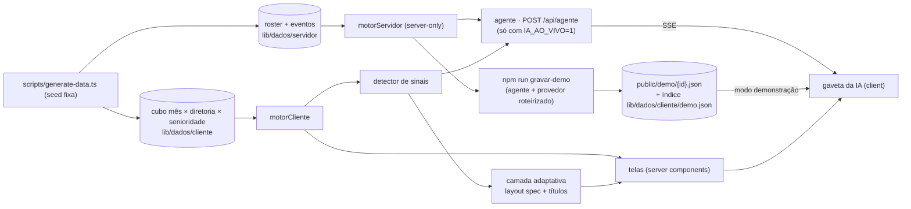

# Arquitetura

Regra que atravessa todas as camadas: **a IA decide a apresentação, o código decide os números.** O modelo escolhe o que destacar, em que ordem e com que palavras; todo número vem do motor determinístico e passa por uma guarda antes de chegar à tela.

## Modos: demonstração e IA ao vivo

- **Leitura:** `modoIA()` (`lib/agente/modo.ts`, `server-only`) devolve `ao-vivo` só com `IA_AO_VIVO=1`; ausente ou qualquer outro valor é `demonstracao`, mesmo com chave no ambiente. O layout raiz passa o modo como prop ao `ProvedorIA`; o navegador não lê variável de ambiente (nada de `NEXT_PUBLIC_*`). `__tests__/agente/modo.test.ts` cobre os dois modos nas duas rotas.
- **Demonstração:** `POST /api/agente` responde 403 `{"erro":"modo demonstração"}` antes de montar qualquer provedor; `GET /api/layout` devolve o pré-gerado (`X-Layout-Fonte: pre-gerado`) ou, fora dele, o determinístico (`X-Layout-Fonte: demonstracao`, cacheável na CDN). Nenhum `fetch` de IA sai do servidor.
- **Roteiro e gravação** (`lib/demo/`): `roteiro-indicadores.ts` (2 perguntas por indicador, a primeira o "O que influenciou"), `roteiro-historias.ts` (as 8 histórias) e `roteiro-resumo.ts` (as perguntas do resumo executivo por lente). Cada entrada traz o recorte, a narração, as rodadas de ferramentas, o que mostrar, o texto final e 1 ou 2 continuações. `gravar.ts` roda o `executarAgente` real com um `Provedor` roteirizado: as ferramentas, os blocos, o rastro e a guarda são os de produção. A gravação falha se uma ferramenta der erro, se o número de blocos não bater, se a guarda não conferir 100% dos números, se o texto fizer conta por extenso (dobro, metade) ou se um bloco de pessoas tiver um único segmento suprimido (ele sairia por subtração do total).
- **Arquivos:** uma resposta por arquivo em `public/demo/<id>.json` (baixada no clique) e o índice em `lib/dados/cliente/demo.json` (id, pergunta, recorte, continuações e onde cada pergunta aparece), que entra no bundle. `__tests__/demo/gravacoes.test.ts` regrava tudo e compara com os arquivos, confere o índice, a guarda, a supressão e a ausência de dado de pessoa.
- **Tocador** (`lib/demo/tocador.ts`): `linhaDoTempo` põe os eventos gravados numa linha do tempo sorteada com semente fixa (o id): 1,5 a 3 s de "pensando", passos que concluem em 300 a 900 ms, blocos a cada 150 a 250 ms e o texto em pedaços de 1 a 3 palavras. A escrita parte de 50–70 caracteres/s e acelera para a resposta inteira caber em 6 a 10 s (com textos de 421 a 931 caracteres, quase sempre acelera). `tocar` entrega cada evento ao mesmo `aplicarEvento` do stream ao vivo, um timer por vez; `mostrarTudo` aplica o resto na hora, cancelar para os timers e, com `prefers-reduced-motion`, tudo sai de uma vez. `__tests__/demo/tocador.test.ts` usa relógio falso. Na gaveta, o rótulo de atividade é "Analisando…" até chegar o primeiro bloco e "Escrevendo a análise…" depois dele.

## Dados

- **Gerador:** `scripts/generate-data.ts` chama `gerar()` (`scripts/sim/gerar.ts`), que simula a Verta S.A. pessoa a pessoa, mês a mês, de Out/2023 a Set/2026, com 6 meses de aquecimento antes da janela. A seed é fixa (`SEED` em `scripts/sim/calibracao.ts`) e o PRNG é próprio, então rodar de novo dá os mesmos bytes (`__tests__/analytics/determinismo.test.ts`). As histórias e os mecanismos estão em [`narrativa.md`](narrativa.md).
- **Roster no servidor:** `lib/dados/servidor/roster.json` (~6,6 MB) e `eventos.json` (~3 MB) têm cada pessoa com 16 dimensões (diretoria, especialidade, senioridade, gênero, raça, faixa salarial, performance, eNPS, trocas de gestor, onboarding…) e cada admissão, saída, promoção, movimentação e vaga. Só `lib/analytics/servidor.ts` os importa, e ele começa com `import 'server-only'`.
- **Cubo no cliente:** `lib/dados/cliente/cubo.json` (~177 KB, ~52 KB gzip) é o mesmo dado agregado por mês × diretoria × senioridade, com todas as medidas. É o único JSON que um módulo importável pelo navegador alcança; `__tests__/analytics/orcamento.test.ts` percorre o grafo de imports e falha se isso mudar ou se passar de 150 KB gzip.
- **Fatos aditivos:** `lib/analytics/fatos.ts` transforma o roster em três tabelas colunares (fluxo, estoque, vagas) em que toda medida é contagem ou soma. Qualquer recorte é a soma das linhas que passam nos filtros, e os segmentos reconciliam com o total por construção.

## Motor e catálogo

- **Catálogo** (`lib/analytics/catalog.ts`): 30 indicadores em 7 domínios, declarativos: pergunta, fórmula, unidade, polaridade, meta com origem e tolerância, dimensões válidas e cálculo (`total`, `razao` ou `compa`). O painel mostra 25 (`lib/painel/indicadores.ts`).
- **Motor** (`lib/analytics/engine.ts`): `criarMotor(fonte)` responde `valor`, `serie`, `decompor`, `cruzar`, `comparar`, `drivers` e `impacto` para qualquer indicador. Todo resultado traz um `rastreio` (função, fórmula, parâmetros, período efetivo, n, fonte). Recorte inválido vira `ErroConsulta` com as opções válidas.
- **Dois motores, o mesmo código:** `motorCliente` (`cliente.ts`) roda sobre o cubo e alimenta as telas e os sinais; `motorServidor()` (`servidor.ts`) roda sobre o roster, aceita todas as dimensões e é o único com `drivers` (lift por atributo e por par de atributos).
- **Status contra a meta:** `dentro` quando o valor está na meta ou melhor; `atencao` quando está pior, mas dentro da tolerância (padrão 10% da meta); `fora` além disso. Amostra abaixo de 30 vem marcada como insuficiente.
- **Amostra pequena não sai (k-anonimato):** se a amostra do indicador conta pessoas (quadro, exposição, liderança, gestores, respondentes de eNPS) e o recorte tem menos de 30, o motor devolve `valor` e `n` nulos, `status` `sem_dados` e `suprimido: { motivo: 'amostra_insuficiente', minimo: 30 }`, sem as somas do rastreio; segmento, célula ou ponto de série pequenos saem sem valor, n, peso nem composição. Vale para toda função e para os dois motores. Vagas e ofertas não identificam ninguém: ficam só marcadas como frágeis. A frase que chega ao modelo e à tela é "amostra insuficiente (menos de 30 pessoas) — valor não divulgado". Limite conhecido: a supressão é consulta a consulta, então subtrair dois recortes públicos (o total menos os demais segmentos) ainda chega à soma do recorte suprimido.
- **Esquemas** (`lib/analytics/schemas.ts`): um JSON Schema por função do motor, com um validador próprio. Os mesmos esquemas viram as tools do agente.

## Detector de sinais

`lib/analytics/signals.ts` percorre o catálogo num recorte e devolve sinais com evidência em texto e pontos de dado: `fora_da_meta`, `outlier_entre_diretorias`, `quebra_de_tendencia`, `piora_acelerada`, `sazonalidade` e `indicador_antecedente` (eNPS → turnover voluntário, vagas abertas → horas extras → absenteísmo). Cada sinal tem um score de 0 a 1, ponderado pela lente (CEO, CHRO, gestor). Os sinais alimentam o resumo executivo, a seção de sinais de cada indicador e a tool `sinais` do agente.

## Agente

- **Rota:** `POST /api/agente` (`app/api/agente/route.ts`, Node.js, `maxDuration = 120`, que depende do fluid compute). Só responde com `IA_AO_VIVO=1`; no modo demonstração devolve 403. `lib/agente/http.ts` valida o corpo, corta o histórico em 12 mensagens, limita a 10 pedidos válidos por minuto por IP (sem cabeçalho de IP, um balde global de 3) e responde em SSE, com o comentário `: ping` a cada 10 s de silêncio.
- **Loop** (`lib/agente/agente.ts`): até 6 rodadas de ferramentas; as chamadas da mesma rodada rodam juntas. Depois disso o modelo é obrigado a responder em texto. O system prompt (`prompt.ts`) traz o catálogo, as convenções de tempo, a regra dos números e, no deep dive, o recorte clicado e o roteiro (o que aconteceu, onde se concentra, por quê, quanto custa, o que fazer).
- **Ferramentas** (`ferramentas.ts`): uma por função do motor, mais `listarIndicadores`, `sinais` e `mostrar`. O modelo recebe um resumo arredondado do resultado, com campos prontos para não fazer contas (distância e razão contra a meta, status em palavras, maior e menor segmento, variação). Argumento inválido volta como erro legível e o modelo corrige na rodada seguinte; o mesmo vale para série com mais de 24 pontos e cruzar com mais de 30 combinações. Cada resumo tem teto de 5.000 bytes: acima disso a maior lista é cortada, com aviso de como pedir menos.
- **Blocos** (`blocos.ts`): `mostrar` aponta um resultado (r1, r2…) e um tipo (kpi, série, barras, tabela, comparação); o servidor monta o bloco com os números do motor. Sem `mostrar`, o servidor escolhe até 2 blocos sozinho. A tabela de fatores abre com os 5 maiores riscos e as 3 maiores proteções por lift; o resto fica em "ver todos".
- **Eventos SSE** (`contrato.ts`): `passo` (início e fim de cada consulta), `texto` (streaming), `bloco`, `rastro` ("Como calculei") e `fim` com a verificação, ou `erro` com mensagem amigável.
- **Guarda** (`guarda.ts`): extrai cada número do texto (%, p.p., R$ mil/mi, ×) e procura nos resultados da conversa e no prompt, com tolerância de meia unidade da última casa escrita. No agente ela mede e marca o que não bateu; não bloqueia.
- **Provedores** (`llm.ts`): DeepSeek é o principal (`DEEPSEEK_API_KEY`, raciocínio desligado), OpenRouter é a reserva (`OPENROUTER_API_KEY`). Falha antes do primeiro texto (rede, HTTP fora de 2xx, 20 s sem chunk) passa para o próximo provedor, e o que respondeu fica na frente nas rodadas seguintes. Tudo com `fetch` e parser de SSE próprios.

## Camada adaptativa

- **Layout spec** (`lib/layout/spec.ts`): o resumo executivo de cada recorte (período, diretoria, lente) é um JSON com manchete, cards, gráficos, anotações e perguntas de deep dive. A IA só referencia sinais e âncoras por id; o código monta a estrutura e os gráficos com os dados do motor.
- **Pré-geração:** `scripts/generate-layouts.ts` gera os 21 layouts padrão (Set/26 × empresa e 6 diretorias × 3 lentes) em `lib/dados/cliente/layouts.json`; `scripts/generate-destaques.ts` gera um título por indicador em `destaques.json`. Os dois juntos ficam abaixo de 60 KB gzip (`__tests__/layout/padrao.test.ts`).
- **Guarda bloqueante:** layout fora do schema, com sinal ou âncora inexistente, com número que não está na evidência dos sinais ou com texto que cita uma diretoria diferente da do sinal que o justifica é descartado (`validarLayout` e `diretoriasForaDoSinal`); título com número fora da frase determinística e dos sinais do indicador também. O card fica ligado ao sinal da diretoria que o título cita. Anotação cujo mês não está na série do gráfico que a exibe sai (`anotacoesDesenhaveis`); o histórico desenhado, até 36 meses, conta.
- **Fallback determinístico** (`deterministico.ts`): ordena os sinais por score e monta o layout sem IA. É o que a tela usa quando não há layout pré-gerado ou quando a guarda barra.
- **Ao vivo** (só com `IA_AO_VIVO=1`): fora dos recortes pré-gerados, a tela renderiza o determinístico e o cliente pede `GET /api/layout` (`maxDuration = 60`), que gera com a IA, guarda em cache e devolve o cabeçalho `X-Layout-Fonte`. Só aceita a mesma origem (`Origin` ou `Referer` do próprio host; sem os dois, 403) e, por instância, até 40 gerações e US$ 0,10 estimados por hora; estourou, sai o determinístico (`X-Layout-Fonte: cota`), nunca erro HTTP. No modo demonstração a rota não chama a IA (ver Modos).

## Frontend

- **Rotas** (App Router, todas server components): `/` gerencial, `/resumo` resumo executivo, `/indicadores/[id]` indicador (`/indicadores` redireciona para `/indicadores/turnover` mantendo os filtros), mais `loading`, `error` e `not-found`. As telas leem os filtros da URL (`lib/painel/filtros.ts`: `mes`, `diretoria`, `senioridade`, `lente`; o padrão fica fora da URL) e montam modelos de vista em `lib/painel/`.
- **Componentes client** só onde há interação: barra de filtros, linhas clicáveis, resumo com layout ao vivo e a IA.
- **Gaveta da IA:** `ProvedorIA` fica no layout raiz; `lib/ia/loja.ts` guarda as conversas por pedido (reabrir não pergunta de novo) e `lib/ia/stream.ts` lê o SSE e aplica cada evento ao turno. `components/ia/PainelIA.tsx` mostra os passos, o texto em Markdown com os números não conferidos marcados, os blocos, "Como calculei" e o selo da guarda. É uma gaveta de 460 px no desktop e uma folha de baixo para cima no celular; Esc fecha e devolve o foco. No modo demonstração, um aviso no topo leva ao README, o campo de texto vira a lista de perguntas prontas da tela (`perguntasProntas` em `lib/demo/indice.ts`), o ✦ toca o "O que influenciou" do indicador, cada resposta mostra o chip do recorte gravado (e uma linha avisando quando a tela está em outro filtro) e termina com as continuações; "Mostrar tudo" ou um clique completa a animação.

## Verificação

- Testes (`__tests__/`, Vitest) sem rede: o modelo é um `fetch` falso. Cobrem o motor contra referências independentes, a narrativa (cada história aparece no indicador, no deep dive e no detector), o agente, a guarda, o layout, os modelos de vista, os dois modos das rotas e as respostas gravadas (regravadas e comparadas byte a byte, com o tocador num relógio falso).
- `npm run orcamento` mede o JS da primeira carga por rota depois do build e falha acima de 400 KB.
- CI em `.github/workflows/ci.yml`: tipos, lint, testes, build e orçamento em todo push e pull request.
- `scripts/avaliar-agente.ts` faz a avaliação real com 20 perguntas (gasta a chave, fica fora do CI).
